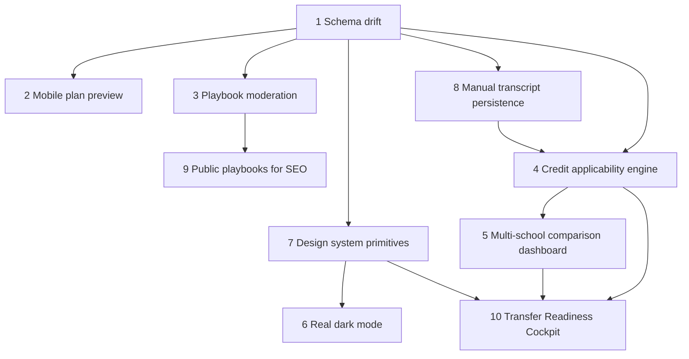

# CareerAC Improvements Implementation Plan

> **For Claude:** REQUIRED SUB-SKILL: Use superpowers:executing-plans to implement this plan task-by-task.

**Goal:** Ship all 10 CareerAC improvements across schema integrity, planning UX, playbook trust, transfer intelligence, theming, SEO, and dashboard polish without regressing current plan generation.

**Architecture:** Stabilize Supabase first so the app has a trustworthy source of truth. Then split work into four tracks that can run in parallel after the schema fix: planner UX, playbook trust/public SEO, transcript persistence, and transfer-intelligence. Converge those tracks through a shared UI primitive layer so dark mode, mobile fixes, and the readiness cockpit are built once instead of repeatedly restyled.

**Tech Stack:** Next.js 15 App Router, React 19, Tailwind CSS v4, TypeScript strict, Supabase Postgres/Auth/Storage, Vitest + React Testing Library, Vercel AI SDK.

---

## Bottom-line recommendation

Execute this as **5 PRs across 4 waves**.

1. **PR 1 / Wave 0:** Task 1 only (schema drift) — unblock everything else.
2. **PR 2 / Wave 1:** Tasks 2, 3, 7, 8 in parallel.
3. **PR 3 / Wave 2:** Tasks 4, 6, 9 in parallel after their prerequisites land.
4. **PR 4 / Wave 3:** Task 5.
5. **PR 5 / Wave 4:** Task 10 + final integration cleanup.

Overall effort: **Large**. The critical path is **1 → 4 → 5 → 10**.

---

## Repository anchors

- Schema and seeds: `supabase/migrations/*.sql`
- Generated DB types: `src/types/database.ts`
- Plan generation pipeline: `src/app/api/chat/route.ts`, `src/lib/plan-pipeline.ts`, `src/lib/context/articulation.ts`, `src/lib/prompt-builder.ts`, `src/utils/plan-parser.ts`
- Plan UI: `src/app/(protected)/plan/new/page.tsx`, `src/app/(protected)/plan/[id]/page.tsx`, `src/app/(protected)/plan/[id]/plan-detail-client.tsx`, `src/components/chat.tsx`, `src/components/semester-plan.tsx`, `src/components/multi-university-view.tsx`
- Transcript flows: `src/components/transcript-upload.tsx`, `src/components/transcript-editor.tsx`, `src/app/api/transcript/upload/route.ts`, `src/app/api/transcript/[id]/route.ts`
- Playbook flows: `src/app/(protected)/playbooks/page.tsx`, `src/app/(protected)/playbooks/[id]/page.tsx`, `src/app/(protected)/playbooks/submit/page.tsx`, `src/app/(protected)/playbooks/submit/playbook-submit-client.tsx`, `src/app/api/playbooks/route.ts`, `src/utils/playbook-context.ts`, `src/components/playbook-card.tsx`, `src/components/playbook-filters.tsx`
- Shared chrome/style: `src/app/layout.tsx`, `src/app/globals.css`, `src/components/header.tsx`, `src/app/page.tsx`, `src/app/(protected)/dashboard/page.tsx`
- Existing tests to extend: `src/app/(protected)/plan/new/new-plan.test.tsx`, `src/components/chat.test.tsx`, `src/components/__tests__/playbook-card.test.tsx`, `src/app/(protected)/playbooks/submit/playbook-submit.test.tsx`, `src/utils/__tests__/playbook-context.test.ts`, `src/app/api/transcript/upload/__tests__/route.test.ts`, `src/components/header.test.tsx`, `src/app/(protected)/plan/[id]/plan-detail.test.tsx`

---

## Parallel task graph

### Recommended wave plan

| Wave | Tasks | Why this grouping works |
| --- | --- | --- |
| Wave 0 | **1** | Root unblocker: migrations 026-037 cannot be trusted until this is fixed. |
| Wave 1 | **2, 3, 7, 8** | Minimal overlap: planner mobile UX, playbook moderation, UI primitives, and transcript persistence can proceed independently once DB/types are stable. |
| Wave 2 | **4, 6, 9** | Applicability engine uses stable schema + transcript records; dark mode builds on shared primitives; public playbooks depends on moderation rules. |
| Wave 3 | **5** | Comparison dashboard should consume deterministic scoring from Task 4 instead of inventing a second scoring system. |
| Wave 4 | **10** | Cockpit is the convergence layer; it should be built after applicability scoring, comparison views, and transcript persistence exist. |

### Safe parallel pairs

- **2 + 3**
- **2 + 8**
- **3 + 7**
- **4 + 6**
- **6 + 9**

### Avoid overlapping in the same PR

- **7 + 6 in the same first-pass refactor PR** if time is tight; keep primitives first, theme second.
- **4 + 5 together**; comparison UI will churn if scoring contracts are still moving.
- **3 + 9 together** unless the moderation API/query contract is already stable.

---

## Task roster

| # | Improvement | Tier | Effort | Category | Suggested skills |
| --- | --- | --- | --- | --- | --- |
| 1 | Fix database schema drift | Critical | Large | `data-foundation` | `superpowers/test-driven-development`, `review`, `verification-before-completion` |
| 2 | Fix mobile plan preview | Critical | Short | `planner-mobile-ux` | `superpowers/test-driven-development`, `browse`, `design-review` |
| 3 | Complete playbook verification workflow | Critical | Medium | `trust-and-moderation` | `superpowers/test-driven-development`, `review`, `browse` |
| 4 | Credit applicability engine | Differentiator | Large | `transfer-intelligence` | `superpowers/test-driven-development`, `review`, `simplify` |
| 5 | Multi-school comparison dashboard | Differentiator | Medium | `comparison-analytics` | `superpowers/test-driven-development`, `browse`, `design-review` |
| 6 | Real dark mode | Differentiator | Short | `theming` | `superpowers/test-driven-development`, `design-review`, `browse` |
| 7 | Unify visual design system | UX Polish | Medium | `design-system` | `design-review`, `simplify`, `review` |
| 8 | Fix manual transcript persistence | UX Polish | Short | `transcript-persistence` | `superpowers/test-driven-development`, `review` |
| 9 | Make playbooks public for SEO | UX Polish | Medium | `seo-routing` | `browse`, `review`, `verification-before-completion` |
| 10 | Add Transfer Readiness Cockpit | UX Polish | Medium/Large | `dashboard-experience` | `superpowers/test-driven-development`, `browse`, `design-review` |

---

## Task 1: Fix database schema drift

**Depends on:** none  
**Blocks:** 2, 3, 4, 7, 8 directly; 5, 6, 9, 10 indirectly

**Files:**
- Modify: `supabase/migrations/001_create_tables.sql`
- Modify: `supabase/migrations/026_aerospace_engineering_major.sql`
- Modify: `supabase/migrations/027_bioengineering_major.sql`
- Modify: `supabase/migrations/028_business_administration_major.sql`
- Modify: `supabase/migrations/029_civil_engineering_major.sql`
- Modify: `supabase/migrations/030_electrical_engineering_major.sql`
- Modify: `supabase/migrations/031_mechanical_engineering_major.sql`
- Modify: `supabase/migrations/032_statistics_major.sql`
- Modify: `supabase/migrations/033_earth_science_geology_major.sql`
- Modify: `supabase/migrations/034_materials_science_engineering_major.sql`
- Modify: `supabase/migrations/035_environmental_engineering_major.sql`
- Modify: `supabase/migrations/036_cell_biology_major.sql`
- Modify: `supabase/migrations/037_biological_sciences_major.sql`
- Create: `supabase/migrations/038_repair_schema_drift.sql`
- Modify: `src/types/database.ts`
- Optional helper test fixture/docs: `docs/validation/schema-drift.md`

**Implementation plan:**
1. Add `majors` and `transfer_pathways` table definitions to `001_create_tables.sql` so a fresh bootstrap can succeed before migrations 026-037 run.
2. Normalize every invalid identifier in migrations 026-037 (`m...`, `i...`, `j...`, `tp-*`) to real UUIDs or valid text keys, and update all foreign-key references consistently inside each file.
3. Add `038_repair_schema_drift.sql` to patch already-deployed databases: create missing tables if absent, backfill indexes, and repair any bad seed rows that were partially inserted before failures.
4. Add a schema validation query/script to assert that `majors` and `transfer_pathways` exist and that every seeded ID satisfies the destination column type.
5. Regenerate `src/types/database.ts` so `majors`, `transfer_pathways`, and all corrected enum/value shapes are reflected in TypeScript.
6. Do not move on until both **fresh-from-zero** and **repair-existing-db** paths are proven.

**Verification:**
- Fresh bootstrap: run a full Supabase reset/apply from zero and confirm migrations 001-038 complete without error.
- Data integrity SQL checks:
  - `majors` exists
  - `transfer_pathways` exists
  - foreign keys from `transfer_pathways.major_id` and `transfer_pathways.institution_id` resolve
  - seed row counts for migrations 026-037 are non-zero
- Type safety: `pnpm tsc --noEmit`
- App-level smoke: `pnpm build`

---

## Task 2: Fix mobile plan preview (Chat/Plan toggle)

**Depends on:** 1  
**Parallel with:** 3, 7, 8

**Files:**
- Modify: `src/app/(protected)/plan/new/page.tsx`
- Modify: `src/app/(protected)/plan/[id]/plan-detail-client.tsx`
- Likely create: `src/components/plan-view-toggle.tsx`
- Optional refine: `src/components/semester-plan.tsx`
- Test: `src/app/(protected)/plan/new/new-plan.test.tsx`
- Test: `src/app/(protected)/plan/[id]/plan-detail.test.tsx`

**Implementation plan:**
1. Add failing tests for mobile state that assert the chat remains visible, the plan remains reachable, and the toggle renders only on small screens.
2. Extract a reusable segmented control/tab toggle (`Chat` / `Plan`) instead of duplicating button logic in both pages.
3. Replace the current `hidden lg:flex` mobile suppression with a state-driven mobile view that defaults to `Chat` when no plan exists and allows switching to `Plan` once `currentPlan` is populated.
4. Preserve current desktop split-pane behavior (`lg` and up) so the fix is isolated to mobile/tablet layouts.
5. Ensure plan detail pages use the same interaction model as plan creation pages so users do not learn two different mobile patterns.
6. If Task 7 lands first, style the toggle with the shared primitive; otherwise keep the API stable so Task 7 can restyle without behavior changes.

**Verification:**
- `pnpm vitest run src/app/(protected)/plan/new/new-plan.test.tsx src/app/(protected)/plan/[id]/plan-detail.test.tsx`
- Manual mobile QA with `/browse`: create a plan, wait for generation, switch between Chat and Plan, refresh, confirm detail page uses same pattern.
- `pnpm build`

---

## Task 3: Complete playbook verification workflow

**Depends on:** 1  
**Blocks:** 9

**Files:**
- Create: `supabase/migrations/039_playbook_moderation.sql`
- Create: `src/app/(protected)/admin/playbooks/page.tsx`
- Create: `src/app/api/playbooks/[id]/moderate/route.ts`
- Create: `src/lib/playbooks/queries.ts`
- Modify: `src/app/api/playbooks/route.ts`
- Modify: `src/app/(protected)/playbooks/page.tsx`
- Modify: `src/app/(protected)/playbooks/[id]/page.tsx`
- Modify: `src/app/(protected)/playbooks/submit/playbook-submit-client.tsx`
- Modify: `src/utils/playbook-context.ts`
- Modify: `src/types/database.ts`
- Test: `src/utils/__tests__/playbook-context.test.ts`
- Test: `src/app/(protected)/playbooks/submit/playbook-submit.test.tsx`
- Create tests for admin moderation flow under `src/app/(protected)/admin/playbooks/`

**Implementation plan:**
1. Add moderation fields to `playbooks`: `updated_at`, `verified_at`, `verified_by`, `rejection_reason`, and optional public-facing slug if Task 9 will use canonical URLs.
2. Add the minimum admin capability needed to moderate safely (recommended: `profiles.is_admin boolean default false`; avoid role logic hidden in client code).
3. Extract playbook queries into `src/lib/playbooks/queries.ts` so list/detail/admin/public pages all share one source of truth for filtering and sort order.
4. Build an authenticated admin queue that lists pending playbooks, shows the submission body, and supports `verify` / `reject` with notes.
5. Update browse queries to sort **verified transferred playbooks first**, then recent inspiration-only entries, with pending/rejected hidden from general browse views.
6. Keep `getVerifiedPlaybooksContext()` strict: only `verification_status='verified'` and `outcome='transferred'` may influence AI planning.

**Verification:**
- DB: confirm moderation columns and admin flag exist; RLS blocks non-admin moderation calls.
- Tests:
  - `pnpm vitest run src/utils/__tests__/playbook-context.test.ts src/app/(protected)/playbooks/submit/playbook-submit.test.tsx`
  - admin API/queue tests pass
- Manual QA with `/browse`: submit playbook as normal user, verify in admin queue, confirm it reorders to the top of browse/detail views.
- `pnpm build`

---

## Task 4: Build the “Will This Credit Actually Advance Me?” engine

**Depends on:** 1  
**Recommended dependency:** 8 so manual transcripts also feed the engine  
**Blocks:** 5, 10

**Files:**
- Create: `src/lib/credit-applicability/engine.ts`
- Create: `src/lib/credit-applicability/types.ts`
- Create: `src/lib/credit-applicability/__tests__/engine.test.ts`
- Likely create: `src/lib/credit-applicability/summary.ts`
- Modify: `src/lib/context/articulation.ts`
- Modify: `src/lib/plan-pipeline.ts`
- Modify: `src/lib/prompt-builder.ts`
- Modify: `src/utils/plan-parser.ts`
- Modify: `src/types/plan.ts`
- Modify: `src/app/(protected)/plan/[id]/page.tsx`
- Modify: `src/app/(protected)/plan/[id]/plan-detail-client.tsx`
- Optional new route: `src/app/api/credit-applicability/route.ts`

**Implementation plan:**
1. Define a deterministic scoring contract before building UI: each transcript course/credit should return `score`, `bucket`, `explanation`, `appliesToRequirementIds`, and `schoolScope`.
2. Use `majors` + `transfer_pathways` + `articulation_agreements` to compute whether a credit is:
   - directly applicable to the chosen pathway,
   - transferable but elective-only,
   - ambiguous/institution-only,
   - non-advancing for the chosen target.
3. Keep the first version rule-based, not AI-generated. AI can narrate the result later, but the source-of-truth score must be reproducible in tests.
4. Attach applicability summaries to plan/detail data structures so downstream UIs (comparison and cockpit) do not re-query the same logic ad hoc.
5. Expose the engine through a reusable server-side service, not directly inside UI components.
6. Preserve graceful degradation: if pathway requirements are missing, return `unknown`/low-confidence states instead of fake certainty.

**Verification:**
- Unit tests cover: direct articulation, elective-only articulation, ambiguous path, no pathway data, mixed transcript with completed + in-progress courses.
- Targeted runs:
  - `pnpm vitest run src/lib/credit-applicability/__tests__/engine.test.ts src/utils/__tests__/plan-parser.test.ts`
- Regression: plan generation still returns parsable JSON for single-school and multi-school modes.
- `pnpm tsc --noEmit && pnpm build`

---

## Task 5: Multi-school comparison dashboard

**Depends on:** 4  
**Feeds:** 10

**Files:**
- Modify: `src/components/multi-university-view.tsx`
- Likely create: `src/components/comparison-dashboard.tsx`
- Likely create: `src/components/comparison-metric-card.tsx`
- Modify: `src/components/semester-plan.tsx`
- Modify: `src/types/plan.ts`
- Modify: `src/utils/plan-parser.ts`
- Modify: `src/lib/prompt-builder.ts`
- Test: `src/components/semester-plan.test.tsx`
- Create: `src/components/multi-university-view.test.tsx`

**Implementation plan:**
1. Replace the current “pick one card, inspect below” layout with a true side-by-side comparison surface for the top 2-4 schools.
2. Drive comparison metrics from Task 4 outputs, not just AI-provided `fitScore`: requirement coverage, advancing credits, risky credits, remaining semesters, next must-take courses, GPA competitiveness.
3. Keep the current detailed semester plan drill-down, but make it a secondary pane/modal rather than the only way to compare schools.
4. Standardize sort order and ranking labels (`Best fit`, `Fastest path`, `Least wasted credit`, etc.) so the dashboard answers why a school is ranked where it is.
5. Use shared primitive cards/badges from Task 7 if available.
6. Keep the plan JSON contract backward-compatible or version it explicitly if the parser shape must change.

**Verification:**
- `pnpm vitest run src/components/semester-plan.test.tsx src/components/multi-university-view.test.tsx src/utils/__tests__/plan-parser.test.ts`
- Manual QA with `/browse`: create multi-school plan, confirm side-by-side metrics, compare at least three schools, drill into one plan.
- `pnpm build`

---

## Task 6: Implement real dark mode

**Depends on:** 7 recommended  
**Parallel with:** 4, 9 after Task 7 lands

**Files:**
- Create: `src/components/theme-provider.tsx`
- Create: `src/components/theme-toggle.tsx`
- Create: `src/hooks/use-theme.ts`
- Modify: `src/app/layout.tsx`
- Modify: `src/app/globals.css`
- Modify: `src/components/header.tsx`
- Test: `src/components/header.test.tsx`
- Create: `src/components/theme-provider.test.tsx`

**Implementation plan:**
1. Add a small client-side theme provider that supports `light`, `dark`, and `system`.
2. Persist the explicit user choice in `localStorage`; when unset, honor `prefers-color-scheme`.
3. Inject the theme class on first paint in `layout.tsx` to avoid flash-of-wrong-theme.
4. Add a theme toggle to the header (desktop + mobile menu) without pushing auth/navigation controls off-screen.
5. Move hard-coded one-off background colors in `globals.css` and high-traffic components onto theme tokens so dark mode is consistent, not piecemeal.
6. Keep the API tiny: one provider, one hook, one toggle.

**Verification:**
- `pnpm vitest run src/components/header.test.tsx src/components/theme-provider.test.tsx`
- Manual QA with `/browse`: switch light/dark/system, refresh, open mobile nav, verify persistence and system fallback.
- `pnpm build`

---

## Task 7: Unify the visual design system

**Depends on:** 1  
**Improves:** 2, 6, 9, 10

**Files:**
- Modify: `src/app/globals.css`
- Create: `src/components/ui/button.tsx`
- Create: `src/components/ui/card.tsx`
- Create: `src/components/ui/badge.tsx`
- Create: `src/components/ui/page-shell.tsx`
- Create: `src/components/ui/segmented-control.tsx`
- Modify: `src/components/header.tsx`
- Modify: `src/app/(protected)/dashboard/page.tsx`
- Modify: `src/app/(protected)/playbooks/page.tsx`
- Modify: `src/app/(protected)/playbooks/[id]/page.tsx`
- Modify: `src/app/(protected)/plan/new/page.tsx`
- Modify: `src/app/(protected)/plan/[id]/plan-detail-client.tsx`
- Modify: `src/app/page.tsx`

**Implementation plan:**
1. Decide the system first: one surface model, one spacing scale, one badge language, one button hierarchy. Do not mix “glassmorphism cards”, “plain utilitarian forms”, and “generic gray cards” on the same screen anymore.
2. Extract only the primitives needed by current surfaces: button, card, badge, page shell, segmented control. Do not build a giant component library.
3. Refactor the highest-traffic pages onto those primitives: dashboard, plan create/detail, playbooks browse/detail, and landing page header/CTA.
4. Use token names in `globals.css` for surface, border, muted text, accent, success, warning, and error states so Task 6 can theme them once.
5. Keep component APIs thin and composable; this is a primitive pass, not a design-system rewrite with variants for every edge case.
6. After refactor, run `simplify`-style cleanup to remove dead utility piles and duplicated badge/button classes.

**Verification:**
- Lint/typecheck changed components
- Manual visual QA with `/browse` across landing, dashboard, new plan, plan detail, playbooks list/detail
- `pnpm build`

---

## Task 8: Fix manual transcript persistence

**Depends on:** 1  
**Feeds:** 4, 10

**Files:**
- Create: `supabase/migrations/040_manual_transcripts.sql`
- Create: `src/app/api/transcript/manual/route.ts`
- Modify: `src/components/transcript-upload.tsx`
- Modify: `src/components/transcript-editor.tsx`
- Modify: `src/app/api/transcript/[id]/route.ts`
- Modify: `src/types/database.ts`
- Create tests under: `src/app/api/transcript/manual/__tests__/route.test.ts`
- Extend: `src/app/api/transcript/upload/__tests__/route.test.ts`

**Implementation plan:**
1. Add a proper manual transcript insert path instead of passing an empty transcript ID.
2. Recommended DB change: allow `parse_method = 'manual'` and keep synthetic `file_name`/`file_path` values deterministic (`Manual Entry`, `manual://<user>/<timestamp>`), so the existing `transcripts` table remains the single source of truth.
3. Create `POST /api/transcript/manual` that authenticates the user, validates the manual transcript payload, inserts a transcript row, and returns the new transcript ID.
4. Update `TranscriptUpload.handleConfirmManual()` to call the new route, then continue into the existing plan flow with a real transcript ID.
5. Ensure transcript edit/save still works for manual transcripts via `PATCH /api/transcript/[id]`.
6. Confirm that plan detail pages now render the transcript summary/editor even when the original transcript came from manual entry.

**Verification:**
- `pnpm vitest run src/app/api/transcript/upload/__tests__/route.test.ts src/app/api/transcript/manual/__tests__/route.test.ts`
- Manual QA: force parser failure → enter courses manually → continue to plan → open saved plan detail → edit transcript → refresh.
- `pnpm build`

---

## Task 9: Make playbooks public for SEO

**Depends on:** 3  
**Parallel with:** 4, 6 after 3 lands

**Files:**
- Modify: `src/utils/supabase/middleware.ts`
- Create public routes: `src/app/playbooks/page.tsx`, `src/app/playbooks/[id]/page.tsx`
- Keep protected submit route: `src/app/(protected)/playbooks/submit/page.tsx`
- Modify or reuse query helpers from: `src/lib/playbooks/queries.ts`
- Create: `src/app/sitemap.ts`
- Optional metadata helpers: `src/app/playbooks/[id]/page.tsx` `generateMetadata`
- Modify: `src/app/page.tsx`
- Create tests for public page access and metadata behavior

**Implementation plan:**
1. Move browse/detail pages out of the protected route group while keeping `/playbooks/submit` authenticated.
2. Update middleware so `/playbooks` and `/playbooks/[id]` are public, but `/playbooks/submit` and admin moderation remain protected.
3. Public browse should default to **verified transferred** playbooks only (or at minimum hide pending/rejected); do not index pending submissions.
4. Add canonical metadata/Open Graph data for playbook detail pages using the school/major/year fields.
5. Add a sitemap entry for public playbook URLs.
6. Update the landing page to expose public playbooks as a trust/SEO surface, not only after sign-in.

**Verification:**
- Anonymous user can open `/playbooks` and a verified detail page without redirect.
- Anonymous user cannot open `/playbooks/submit`.
- Metadata/source inspection shows meaningful title/description/OG tags.
- `/browse` smoke on signed-out session + `pnpm build`

---

## Task 10: Add Transfer Readiness Cockpit dashboard

**Depends on:** 4, 5, 8  
**Recommended dependency:** 7 for shared cards/metrics

**Files:**
- Modify: `src/app/(protected)/dashboard/page.tsx`
- Create: `src/components/transfer-readiness-cockpit.tsx`
- Create: `src/lib/dashboard/readiness.ts`
- Create: `src/lib/dashboard/__tests__/readiness.test.ts`
- Likely create: `src/components/readiness-score-card.tsx`
- Likely create: `src/components/readiness-action-list.tsx`
- Reuse from Task 4/5 outputs
- Extend: `src/app/(protected)/dashboard/dashboard.test.tsx`

**Implementation plan:**
1. Define what the cockpit owns: overall readiness score, advancing-credit summary, top blockers, next courses, transcript completeness, and best-school snapshot.
2. Compute readiness deterministically in `src/lib/dashboard/readiness.ts` from Task 4 applicability outputs, Task 5 comparison outputs, and transcript presence from Task 8.
3. Keep the dashboard actionable, not just descriptive: “upload transcript”, “complete Calculus II”, “your top-fit school is UCLA”, “3 credits currently not advancing”.
4. Integrate the cockpit at the top of the existing dashboard page without removing current plan list functionality.
5. Use shared metric cards/badges from Task 7 and theme tokens from Task 6.
6. Gracefully handle empty states: no transcript, single-school only, no articulated pathway data, no saved plans.

**Verification:**
- `pnpm vitest run src/lib/dashboard/__tests__/readiness.test.ts src/app/(protected)/dashboard/dashboard.test.tsx`
- Manual QA: user with no transcript, user with manual transcript, user with multi-school plan, user with verified playbook context.
- `pnpm build`

---

## Cross-cutting verification gates

Run these at the end of each PR, not only at the very end:

1. **Changed-file diagnostics clean**
2. **Targeted Vitest suite for the touched area passes**
3. `pnpm lint`
4. `pnpm tsc --noEmit`
5. `pnpm build`
6. For UI/SEO/mobile tasks: one manual `/browse` pass with screenshots or written notes

Final full-project confidence run after Task 10:

- `pnpm vitest run`
- `pnpm tsc --noEmit`
- `pnpm build`

---

## Recommended PR slicing

### PR 1 — Schema repair
- Task 1 only

### PR 2 — Planner/mobile/transcripts
- Task 2
- Task 8
- Optional shared toggle primitive from Task 7 if needed

### PR 3 — Playbook trust + public foundation
- Task 3
- Task 9

### PR 4 — Design/theming
- Task 7
- Task 6

### PR 5 — Intelligence surfaces
- Task 4
- Task 5
- Task 10

This keeps the largest logic churn (Task 4/5/10) isolated from routing/migration churn.

---

## Risks and mitigations

### 1. Historical migration edits can break already-applied environments
- **Mitigation:** pair historical fixes with `038_repair_schema_drift.sql`; verify both fresh reset and repair-on-existing paths.

### 2. AI-generated multi-school ranking may conflict with deterministic scoring
- **Mitigation:** make Task 4 the source of truth; Task 5 displays deterministic metrics and lets AI provide narrative only.

### 3. Public playbooks can expose low-trust or pending submissions
- **Mitigation:** Task 9 only indexes verified playbooks; pending/rejected remain authenticated/private surfaces.

### 4. Dark mode can become a class-name chase
- **Mitigation:** Task 7 must extract tokens/primitives before broad theme rollout.

### 5. Manual transcript entries can fork the transcript model
- **Mitigation:** keep manual entry inside the existing `transcripts` table, with a proper `parse_method='manual'` path.

---

Plan complete and saved to `docs/plans/2026-04-15-careerac-improvements.md`.

Two execution options:

**1. Subagent-Driven (this session)** — use `superpowers:subagent-driven-development` and execute wave-by-wave here.

**2. Parallel Session (separate)** — open a new session and use `superpowers:executing-plans` against this plan file.
